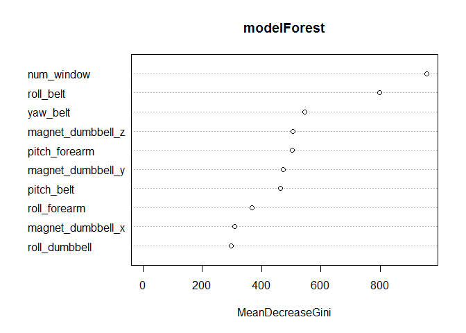

# Practical Machine Learning - Course Project
franmarq@gmail.com  
08 de marzo de 2018  


```r
knitr::opts_chunk$set
```

```
## function (...) 
## {
##     dots = list(...)
##     if (length(dots) == 0) 
##         return()
##     if (is.null(names(dots)) && length(dots) == 1 && is.list(dots[[1]])) 
##         if (length(dots <- dots[[1]]) == 0) 
##             return()
##     defaults <<- merge(dots)
##     invisible(NULL)
## }
## <environment: 0x000000000869cd40>
```

### Executive Summary
Using devices such as Jawbone Up, Nike FuelBand, and Fitbit it is now possible to collect a large amount of data about personal activity relatively inexpensively. These type of devices are part of the quantified self movement - a group of enthusiasts who take measurements about themselves regularly to improve their health, to find patterns in their behavior, or because they are tech geeks. One thing that people regularly do is quantify how much of a particular activity they do, but they rarely quantify how well they do it. In this project, your goal will be to use data from accelerometers on the belt, forearm, arm, and dumbell of 6 participants. They were asked to perform barbell lifts correctly and incorrectly in 5 different ways. More information is available from the website here: http://groupware.les.inf.puc-rio.br/har (see the section on the Weight Lifting Exercise Dataset).

The training data for this project are available here:
https://d396qusza40orc.cloudfront.net/predmachlearn/pml-training.csv

The test data are available here:
https://d396qusza40orc.cloudfront.net/predmachlearn/pml-testing.csv

The data for this project come from this source: http://groupware.les.inf.puc-rio.br/har. If you use the document you create for this class for any purpose please cite them as they have been very generous in allowing their data to be used for this kind of assignment.


### Data Preparation

First i load the packages that i need to process and read the data from the source in the web, initially i do some cleaning task. I'm going to set a seed pseudo-random number at '7472' for all code, it for make reproducible the results. 


```r
library(caret); library(randomForest);library(rpart); library(curl); library(lattice); library(ggplot2)
```

```
## Loading required package: lattice
```

```
## Loading required package: ggplot2
```

```
## randomForest 4.6-12
```

```
## Type rfNews() to see new features/changes/bug fixes.
```

```
## 
## Attaching package: 'randomForest'
```

```
## The following object is masked from 'package:ggplot2':
## 
##     margin
```


```r
#### Data training

URL<- "https://d396qusza40orc.cloudfront.net/predmachlearn/pml-training.csv"
train = read.csv(file=URL, na.strings=c("NA","#DIV/0!", ""))#detect blanks in variables and change for NA 
train <- subset(train, select=-c(1:6)) #remove row numbers, time stamp and user names
train2<-train[,colSums(is.na(train)) == 0] #remove columns with at least an NA value
classe <- train2$classe #save classe information
train2 <- train2[,sapply(train2,is.numeric)] # remove non-numeric variables
train2$classe <- classe; rm(classe) #add classe information and delete variable

dim(train2)
```

```
## [1] 19622    54
```

```r
#### Data testing

URL2<- "https://d396qusza40orc.cloudfront.net/predmachlearn/pml-testing.csv"
test = read.csv(file=URL2, na.strings=c("NA","#DIV/0!", ""))# detect blanks in variables and change for NA
test <- subset(test, select=-c(1:6)) #remove row numbers, time stamp and user names
test2 <-test[,colSums(is.na(test)) == 0] #remove columns with at least a NA value
test2 <- test2[,sapply(test2,is.numeric)] # remove non-numeric variables

dim(test2)
```

```
## [1] 20 54
```

i have to Identify set column name differences bacause it will be important in the assesment stage (predcition with test set)

```r
trainCol <- names(train2)
testCol <- names(test2)

setdiff(trainCol, testCol)
```

```
## [1] "classe"
```

```r
setdiff(testCol, trainCol)
```

```
## [1] "problem_id"
```

```r
#### in the train data set is the classe variable and in the test data set is the problem_id variable. We haave to consider this difference with we run the model in prediction with test data
```


### Cross-Validation

to make cross validation, i used the caret package to divide the trainig set in 70% to sub training set and 20% to a sub testing set.


```r
set.seed(7472)
samples <- createDataPartition(y=train2$classe, p=0.7, list=FALSE)
sTrain <- train2[samples, ] 
sTest <- train2[-samples, ]

#### an initially distribution of the classe variable in the sub train data set

plot(sTrain$classe,  main="classe in sub-Train data set", xlab="classe", ylab="Frequency")
```

<!-- -->

### Modelling

My idea is to run two models and compare it, i select the 'classe' variable like the outcome, this variables has 5 levels (sitting-down, standing-up, standing, walking, and sitting) collected on 8 hours of activities of 4 healthy subjects.


#### First Model: Decision tree model

```r
set.seed(7472)
modelTree <- rpart(classe ~ ., data=sTrain, method="class")

#### Predicting:
predicTree <- predict(modelTree, sTest, type = "class")

#### Plot of the Decision Tree
library(rattle)
```

```
## Rattle: A free graphical interface for data science with R.
## Versión 5.1.0 Copyright (c) 2006-2017 Togaware Pty Ltd.
## Escriba 'rattle()' para agitar, sacudir y  rotar sus datos.
```

```
## 
## Attaching package: 'rattle'
```

```
## The following object is masked from 'package:randomForest':
## 
##     importance
```

```r
fancyRpartPlot(modelTree,cex=0.4)
```

<!-- -->

```r
#### Now i test the results on our subTesting data set for this first model:
confusionMatrix(predicTree, sTest$classe)
```

```
## Confusion Matrix and Statistics
## 
##           Reference
## Prediction    A    B    C    D    E
##          A 1510  261   39  114   83
##          B   37  609   94   37  101
##          C   19   81  812  159   82
##          D   80  154   53  618  119
##          E   28   34   28   36  697
## 
## Overall Statistics
##                                           
##                Accuracy : 0.7215          
##                  95% CI : (0.7098, 0.7329)
##     No Information Rate : 0.2845          
##     P-Value [Acc > NIR] : < 2.2e-16       
##                                           
##                   Kappa : 0.6456          
##  Mcnemar's Test P-Value : < 2.2e-16       
## 
## Statistics by Class:
## 
##                      Class: A Class: B Class: C Class: D Class: E
## Sensitivity            0.9020   0.5347   0.7914   0.6411   0.6442
## Specificity            0.8820   0.9433   0.9298   0.9175   0.9738
## Pos Pred Value         0.7524   0.6936   0.7042   0.6035   0.8469
## Neg Pred Value         0.9577   0.8941   0.9548   0.9288   0.9239
## Prevalence             0.2845   0.1935   0.1743   0.1638   0.1839
## Detection Rate         0.2566   0.1035   0.1380   0.1050   0.1184
## Detection Prevalence   0.3410   0.1492   0.1959   0.1740   0.1398
## Balanced Accuracy      0.8920   0.7390   0.8606   0.7793   0.8090
```


#### Second Model: Random Forest model

```r
set.seed(7472)
modelForest <- randomForest(classe ~. , data=sTrain, method="class")

#### Predicting:
predicForest <- predict(modelForest, sTest, type = "class")

#### Now i test the results on our subTesting data set for this first model:
confusionMatrix(predicForest, sTest$classe)
```

```
## Confusion Matrix and Statistics
## 
##           Reference
## Prediction    A    B    C    D    E
##          A 1674    4    0    0    0
##          B    0 1132    2    0    0
##          C    0    3 1024   12    0
##          D    0    0    0  951    2
##          E    0    0    0    1 1080
## 
## Overall Statistics
##                                           
##                Accuracy : 0.9959          
##                  95% CI : (0.9939, 0.9974)
##     No Information Rate : 0.2845          
##     P-Value [Acc > NIR] : < 2.2e-16       
##                                           
##                   Kappa : 0.9948          
##  Mcnemar's Test P-Value : NA              
## 
## Statistics by Class:
## 
##                      Class: A Class: B Class: C Class: D Class: E
## Sensitivity            1.0000   0.9939   0.9981   0.9865   0.9982
## Specificity            0.9991   0.9996   0.9969   0.9996   0.9998
## Pos Pred Value         0.9976   0.9982   0.9856   0.9979   0.9991
## Neg Pred Value         1.0000   0.9985   0.9996   0.9974   0.9996
## Prevalence             0.2845   0.1935   0.1743   0.1638   0.1839
## Detection Rate         0.2845   0.1924   0.1740   0.1616   0.1835
## Detection Prevalence   0.2851   0.1927   0.1766   0.1619   0.1837
## Balanced Accuracy      0.9995   0.9967   0.9975   0.9931   0.9990
```

```r
#### Most relevant 10 variables on the model
VarImport <- varImp(modelForest)
varImpPlot(modelForest,n.var = 10)
```

<!-- -->

#### Decision
Based in the results, i choose the Random Forest model because was better to predict the classe variable. 
Tha Accuracy in Random Forest was 0.9959 against 0.7215 in the Decision Tree Model.


### Submission (prediction)
Now i'm goint to predict 20 values in the Testing data set usign the Random Forest Model selected, will predict 'Classe' for each 'problem_id'


```r
predictF <-predict(modelForest, type="class", newdata = test2[,-which(names(test) %in% "problem_id")])
t(data.frame(problem_id = test2$problem_id, prediction = predictF))
```

```
##            1    2    3    4    5    6    7    8    9    10   11   12  
## problem_id " 1" " 2" " 3" " 4" " 5" " 6" " 7" " 8" " 9" "10" "11" "12"
## prediction "B"  "A"  "B"  "A"  "A"  "E"  "D"  "B"  "A"  "A"  "B"  "C" 
##            13   14   15   16   17   18   19   20  
## problem_id "13" "14" "15" "16" "17" "18" "19" "20"
## prediction "B"  "A"  "E"  "E"  "A"  "B"  "B"  "B"
```


### References

[1] Velloso, E.; Bulling, A.; Gellersen, H.; Ugulino, W.; Fuks, H. Qualitative Activity Recognition of Weight Lifting Exercises. Proceedings of 4th International Conference in Cooperation with SIGCHI (Augmented Human '13) . Stuttgart, Germany: ACM SIGCHI, 2013.
